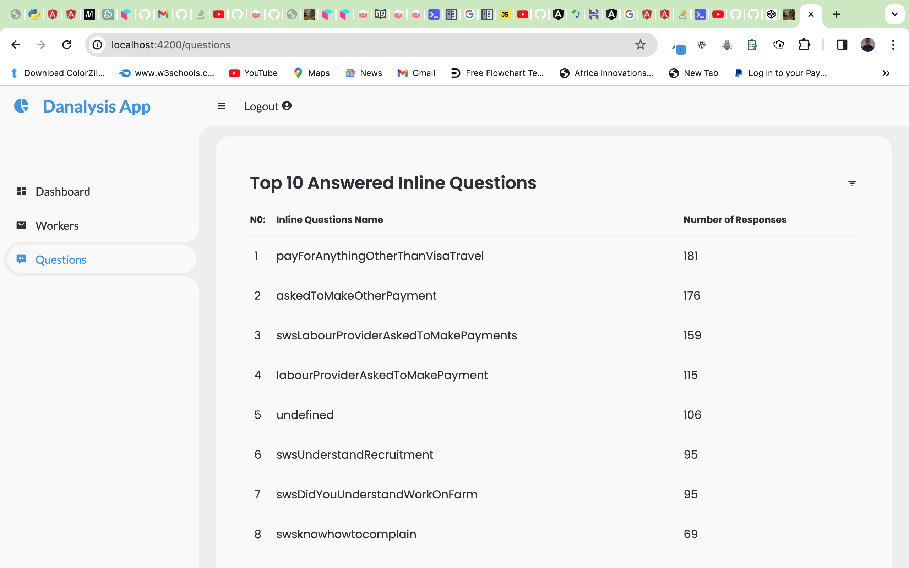
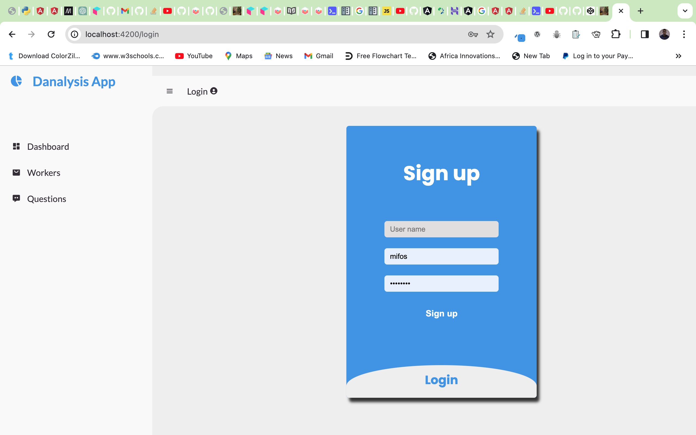

# Danalysis App Frontend

## Task

This is a front-end application design in Angular. This application visualizes data from a backend application Danalysis App Ass Url:https://github.com/Amukayoung/Data-Analysis-Ass

## Technology

- Angular
- Chart js

## Setup
Follow these instructions to get a copy of the project up and running on your local machine.

## Prerequisites
Ensure that you have the following software installed on your machine:

Node.js
npm (Node Package Manager)
Angular CLI
## Installation
Clone the repository to your local machine:
git clone https://github.com/Amukayoung/Data-Analysis-Frontend.git

Navigate to the project directory:

cd Danalysis_frontend

Install dependencies:

npm install

## Running the Application
Run the following command to start the development server:
ng serve
Open your browser and navigate to http://localhost:4200/. The app will automatically reload if you change any source files.
Enjoy the app....

## Sample Screenshots

